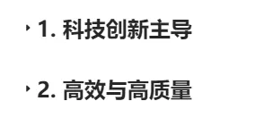

### 新 zhi  生产力的两大核心要素

---

## 1. 科技创新主导
### 定义与背景

- **核心理念**: 新质生产力的根本在于**推动原创性和颠覆性的科技创新**，通过技术突破来引领产业升级和经济发展。
- **创新范畴**: 不仅包括对现有技术的逐步改进和优化，更涉及探索和开发全新的技术和解决方案，以实现高水平的科技自立自强。
### 具体措施

1. **加强基础研究**
   - **资源投入**: 加大在基础科学研究方面的投入，尤其是对人工智能、量子计算、生物技术、新材料等前沿领域的支持。
   - **长远发展**: 通过持续的基础研究，奠定未来科技和产业发展的坚实基础。
2. **支持科技企业发展**
   - **政策支持**: 制定和实施鼓励科技企业创新创业的政策，特别是对中小型科技企业提供融资和税收优惠等支持。
   - **创新动力**: 通过政策和金融支持，激励企业进行更多的研发和创新活动。
3. **促进知识产权保护**
   - **保障创新者权益**: 加强知识产权保护体系，确保创新者的合法权益得到充分保障。
   - **激励创新**: 提供更好的知识产权保护机制，鼓励更多企业和个人投入到科技创新中来。
### 实际案例

- **华为的芯片研发**
   - **自主突破**: 面对外部技术限制，华为加大了在芯片技术上的自主研发力度，成功实现了技术突破，减少了对外部供应商的依赖。
   - **影响**: 这一突破不仅提高了华为自身的竞争力，也对整个中国科技产业的自主创新能力产生了积极影响。
- **阿里的达摩院**
   - **多领域创新**: 阿里巴巴在人工智能、物联网和量子计算等领域持续投入，通过达摩院推动多个前沿科技的商业化应用。
   - **示范作用**: 达摩院的成功案例为其他企业提供了科技创新的参考和激励。

---

## 2. 高效与高质量
### 定义与背景

- **生产率提升**: 新质生产力强调提升全要素生产率（Total Factor Productivity, TFP），通过更高效的生产方式和更高质量的产出，替代传统依赖资源大量投入的经济增长模式。
- **可持续发展**: 这种模式要求在更少的资源消耗和环境压力下，实现更高的经济价值和社会效益。
### 具体措施

1. **智能制造**
   - **技术应用**: 推动制造业向智能化、自动化方向转型，采用先进的生产管理系统和智能设备，提高生产效率和产品质量。
   - **示范效应**: 通过智能制造的应用，提升整个制造业的生产水平和竞争力。
2. **绿色经济**
   - **环保产业**: 发展循环经济和绿色产业，减少资源浪费和环境污染，推动经济增长与生态保护协调发展。
   - **长期效益**: 绿色经济的发展不仅有利于环境保护，也能够为经济的可持续发展提供长期动力。
3. **数字化转型**
   - **技术赋能**: 加快企业的数字化进程，利用大数据、云计算和物联网等技术，提高业务运营效率和市场响应能力。
   - **业务优化**: 数字化转型不仅提升了企业的运营效率，也增强了企业在市场中的竞争力。
### 实际案例

- **美的的智能工厂**
   - **转型升级**: 美的集团通过智能制造改造，显著提升了生产效率和产品质量，成为传统制造业数字化转型的典范。
   - **成效显著**: 这种转型不仅提高了企业的生产效能，也为整个制造业的智能化发展提供了借鉴。
- **宁德时代的绿色电池**
   - **技术突破**: 作为全球领先的动力电池供应商，宁德时代在绿色能源技术方面取得了重大突破，为新能源汽车产业提供了高效、环保的解决方案。
   - **行业影响**: 绿色电池技术的进步推动了新能源产业的发展，也有助于环境保护和可持续发展。

---

### 

通过科技创新和高效、高质量的发展模式，新质生产力将引领中国经济走向新的高度。这不仅应对了当前经济和科技环境的挑战，也为未来的可持续发展奠定了坚实的基础。

